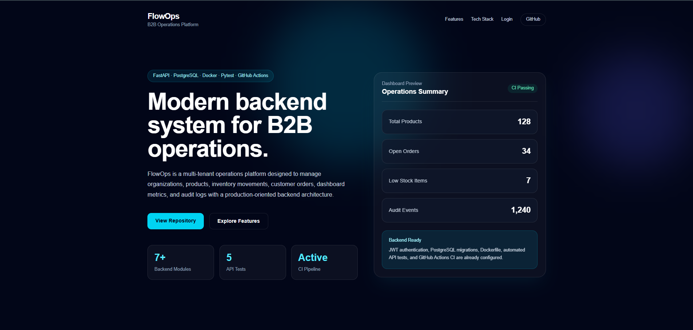
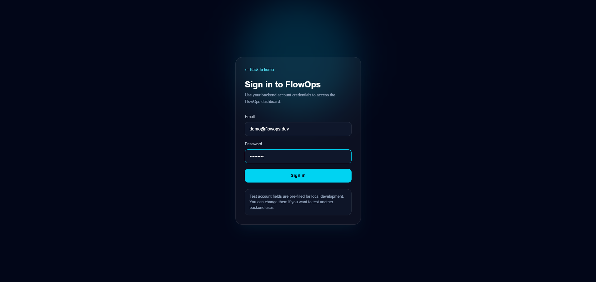
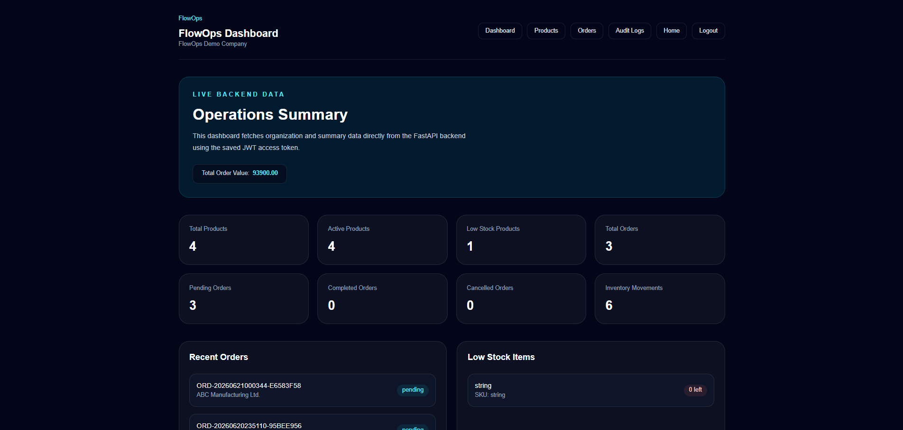
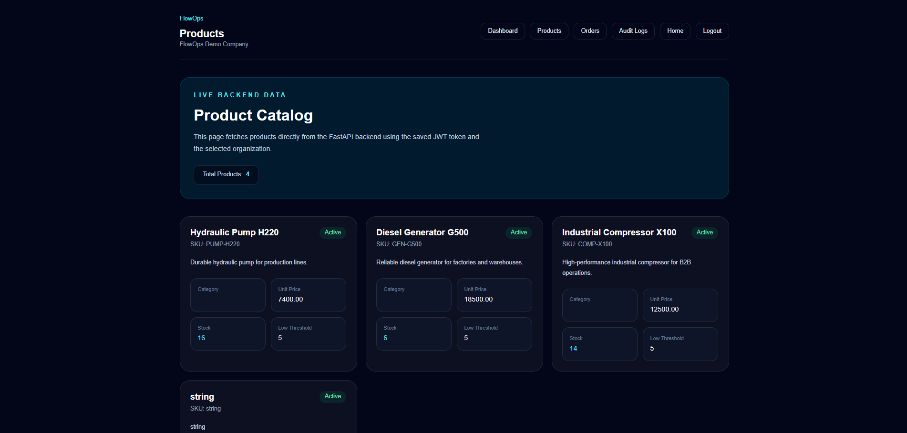
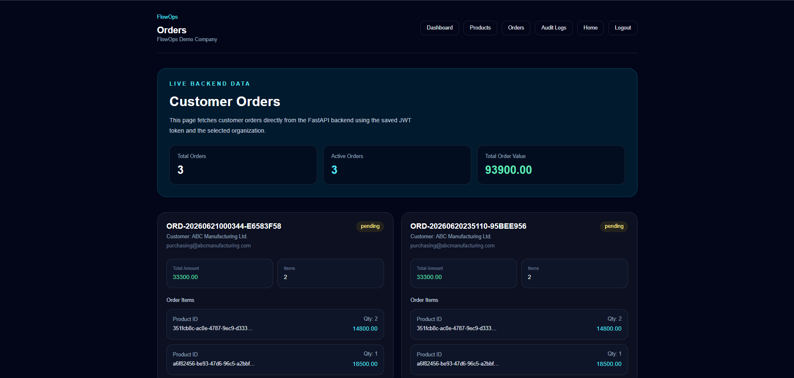
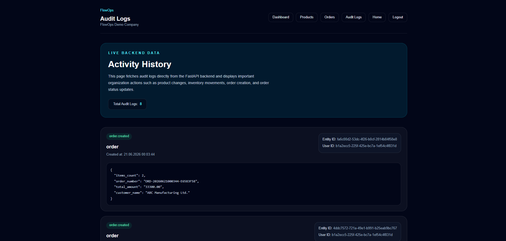

# FlowOps

[](https://github.com/azizefe1/flowops/actions/workflows/backend-ci.yml)

FlowOps is a multi-tenant B2B operations platform built with FastAPI, PostgreSQL, SQLAlchemy, Alembic, JWT authentication, Docker, Next.js, Tailwind CSS, Pytest, and GitHub Actions CI.

The project demonstrates a realistic full-stack business operations system with authentication, organization-based data isolation, inventory management, order management, dashboard metrics, audit logging, Dockerized services, automated tests, and CI validation.

## Features

* User registration and login
* JWT-based authentication
* Multi-tenant organization structure
* Product management
* Inventory stock tracking
* Order creation and stock reduction
* Dashboard summary data
* Audit log tracking
* FastAPI Swagger documentation
* Next.js frontend
* Dockerized backend and frontend
* PostgreSQL and Redis with Docker Compose
* Automated backend tests
* Automated frontend production build check
* Automated Docker image build checks with GitHub Actions

## Screenshots

### Landing Page



### Login Page



### Dashboard



### Products



### Orders



### Audit Logs



## Tech Stack

### Backend

* Python
* FastAPI
* PostgreSQL
* SQLAlchemy
* Alembic
* Pydantic
* JWT Authentication
* Docker
* Redis
* Pytest

### Frontend

* Next.js
* React
* TypeScript
* Tailwind CSS
* App Router

### DevOps & Tooling

* Docker Compose
* Backend Dockerfile
* Frontend Dockerfile
* GitHub Actions CI
* Automated backend tests
* Automated frontend build check
* Automated Docker image build checks

## Project Structure

```text
flowops/
├── backend/
│   ├── app/
│   │   ├── api/
│   │   ├── core/
│   │   ├── db/
│   │   ├── models/
│   │   ├── schemas/
│   │   └── services/
│   ├── alembic/
│   ├── tests/
│   ├── Dockerfile
│   └── requirements.txt
├── frontend/
│   ├── src/
│   │   ├── app/
│   │   ├── components/
│   │   └── lib/
│   ├── Dockerfile
│   └── package.json
├── docs/
│   ├── screenshots/
│   ├── api-overview.md
│   ├── architecture.md
│   ├── database-design.md
│   └── deployment.md
├── scripts/
│   └── seed_demo_data.py
├── docker-compose.yml
└── README.md
```

## CI/CD Status

FlowOps includes a GitHub Actions workflow that runs automatically on every push and pull request to the `main` branch.

The CI pipeline currently includes:

* PostgreSQL service setup
* Redis service setup
* Backend dependency installation
* Alembic database migrations
* Python compile check
* Pytest backend API tests
* Backend Docker image build check
* Frontend dependency installation
* Next.js production build check
* Frontend Docker image build check

This helps ensure that both backend and frontend changes are verified before being considered stable.

## Docker Support

FlowOps includes Docker support for both backend and frontend.

Backend Docker support:

```text
backend/Dockerfile
backend/.dockerignore
```

Frontend Docker support:

```text
frontend/Dockerfile
frontend/.dockerignore
```

Local infrastructure is managed with:

```text
docker-compose.yml
```

The project supports containerized PostgreSQL, Redis, backend API, frontend application, migration execution, and production build preparation.

## Running the Full Stack with Docker Compose

FlowOps can be started locally with Docker Compose.

This command starts the full stack:

```bash
docker compose up --build
```

The following services will be started:

* PostgreSQL
* Redis
* FastAPI backend
* Next.js frontend

After the containers are running, the application is available at:

```text
Frontend: http://localhost:3000
Backend API: http://localhost:8000
API Health Check: http://localhost:8000/api/health
API Documentation: http://localhost:8000/docs
```

To stop the containers, press:

```text
Ctrl + C
```

Then run:

```bash
docker compose down
```

The PostgreSQL data is stored in a Docker volume named:

```text
flowops_postgres_data
```

This allows the database data to persist between container restarts.

## Demo Data Seeding

FlowOps includes a demo seed script for quickly preparing sample data.

First, start the full stack:

```bash
docker compose up --build
```

Then, in a separate terminal, run:

```bash
python scripts/seed_demo_data.py
```

The seed script creates or reuses:

* Demo user
* Demo organization
* Demo products
* Demo order
* Audit log records

Demo login credentials:

```text
Email: demo@flowops.dev
Password: Demo12345
```

After seeding, the frontend can be tested at:

```text
http://localhost:3000
```

The API documentation is available at:

```text
http://localhost:8000/docs
```

## Local Development

### Backend

Start PostgreSQL and Redis:

```bash
docker compose up postgres redis
```

Run the backend locally:

```bash
cd backend
python -m venv .venv
.venv\Scripts\activate
pip install -r requirements.txt
alembic upgrade head
uvicorn app.main:app --reload
```

Backend API:

```text
http://localhost:8000
```

Swagger documentation:

```text
http://localhost:8000/docs
```

### Frontend

Run the frontend locally:

```bash
cd frontend
npm install
npm run dev
```

Frontend:

```text
http://localhost:3000
```

## Testing

Run backend tests:

```bash
cd backend
pytest
```

Run frontend production build:

```bash
cd frontend
npm run build
```

Build backend Docker image:

```bash
cd backend
docker build -t flowops-backend:test .
```

Build frontend Docker image:

```bash
cd frontend
docker build -t flowops-frontend:test .
```

## Current Project Status

FlowOps currently includes:

* Authentication API
* Organization API
* Product API
* Inventory movement API
* Order API
* Dashboard summary API
* Audit logs API
* Connected frontend pages
* Docker Compose full-stack setup
* Demo data seed script
* Backend tests
* Frontend build validation
* GitHub Actions CI
* Project documentation

## Documentation

Additional documentation is available in the `docs` directory:

```text
docs/architecture.md
docs/database-design.md
docs/api-overview.md
docs/deployment.md
```

## Purpose

FlowOps was developed as a professional portfolio project to demonstrate full-stack backend and frontend development, API design, database modeling, Docker usage, automated testing, CI workflows, and project documentation.

## License

This project is developed for portfolio and educational purposes.
